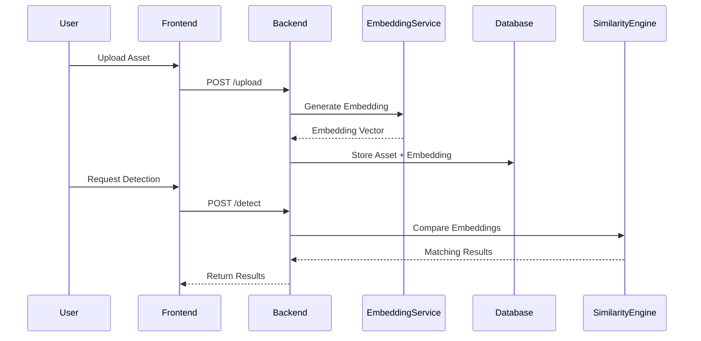
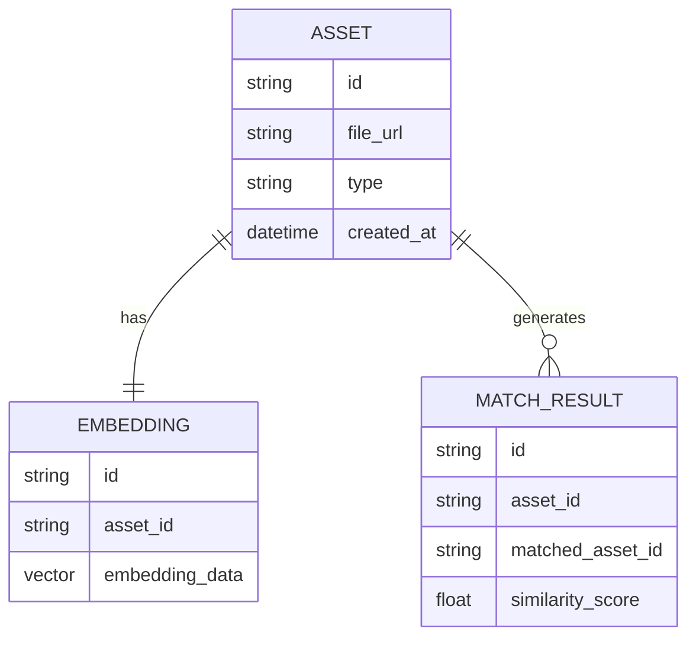

# Seekr - System Design Document

## Overview

Seekr is an AI-powered digital asset tracking system that detects unauthorized usage of media by generating embeddings and performing similarity-based searches. The system is designed to be scalable, modular, and extensible for real-world deployment.

---

## System Goals

- Detect duplicate or modified digital assets
- Provide similarity-based matching
- Enable asset ownership tracking
- Simulate monitoring across distributed sources
- Maintain scalability and modularity

---

## High-Level Architecture

```

User → Frontend → Backend API → Processing Layer → Database / Vector Store
↓
Similarity Engine

````

### Components

1. **Frontend (React)**
   - Upload interface
   - Dashboard visualization

2. **Backend (API Layer)**
   - Handles requests
   - Coordinates processing

3. **Processing Layer**
   - Embedding generation
   - Preprocessing

4. **Similarity Engine**
   - Vector comparison
   - Matching logic

5. **Database**
   - Stores assets and metadata

6. **Vector Store**
   - Stores embeddings for fast search

---

## Use Case Diagram

```mermaid
actor User

User --> (Upload Asset)
User --> (View Dashboard)
User --> (Run Similarity Detection)

(Upload Asset) --> (Generate Embedding)
(Run Similarity Detection) --> (Compare Embeddings)
(Compare Embeddings) --> (Return Matches)
(View Dashboard) --> (Display Results)
````

---

## UML - Component Diagram

```mermaid
graph TD

User --> Frontend
Frontend --> Backend

Backend --> AssetController
Backend --> DetectionController

AssetController --> AssetService
DetectionController --> DetectionService

AssetService --> EmbeddingService
DetectionService --> SimilarityEngine

EmbeddingService --> MLModel
SimilarityEngine --> VectorDB

AssetService --> Database
DetectionService --> Database
```

---

## UML - Sequence Diagram



---

## ERD (Entity Relationship Diagram)



---

## Core Modules

### 1. Asset Management

* Handles upload and storage
* Stores metadata

### 2. Embedding Service

* Converts media into vector representation
* Uses pre-trained ML models

### 3. Similarity Engine

* Performs vector comparison
* Uses cosine similarity or FAISS

### 4. Detection Service

* Orchestrates matching logic
* Returns ranked results

### 5. Monitoring Engine (Simulated)

* Periodically scans dataset
* Triggers detection

---

## Design Patterns Used

### 1. Factory Pattern

Used to create different types of embeddings.

```
EmbeddingFactory
  ├── ImageEmbedding
  ├── VideoEmbedding
```

**Benefit:** Extensible for new media types

---

### 2. Strategy Pattern

Used for similarity algorithms.

```
SimilarityStrategy
  ├── CosineSimilarity
  ├── EuclideanDistance
```

**Benefit:** Easily switch algorithms

---

### 3. Singleton Pattern

Used for database connection and model loading.

```
DatabaseConnection (Singleton)
MLModelLoader (Singleton)
```

**Benefit:** Efficient resource usage

---

### 4. Observer Pattern

Used for monitoring and alerts.

```
MonitoringEngine → Notifies → AlertService
```

**Benefit:** Decoupled alert system

---

### 5. MVC Pattern

* Model → Database schema
* View → Frontend UI
* Controller → API layer

---

## Data Flow

1. User uploads asset
2. Backend processes request
3. Embedding is generated
4. Data is stored in DB + vector store
5. Detection request triggers similarity engine
6. Results returned and displayed

---

## Scalability Considerations

* Use vector databases (FAISS / Pinecone)
* Microservice architecture for ML and API
* CDN for media storage
* Queue system for async processing (e.g., Redis, Kafka)

---

## Security Considerations

* Validate uploaded files
* Rate limiting APIs
* Authentication for access
* Encryption for stored assets

---

## Limitations

* No access to private platforms
* Detection limited to available datasets
* Model accuracy depends on training

---

## Future Improvements

* Real-time monitoring with streaming pipelines
* Integration with external APIs
* Advanced video fingerprinting
* Blockchain-based ownership proof

---
